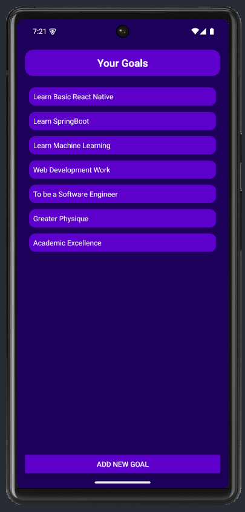
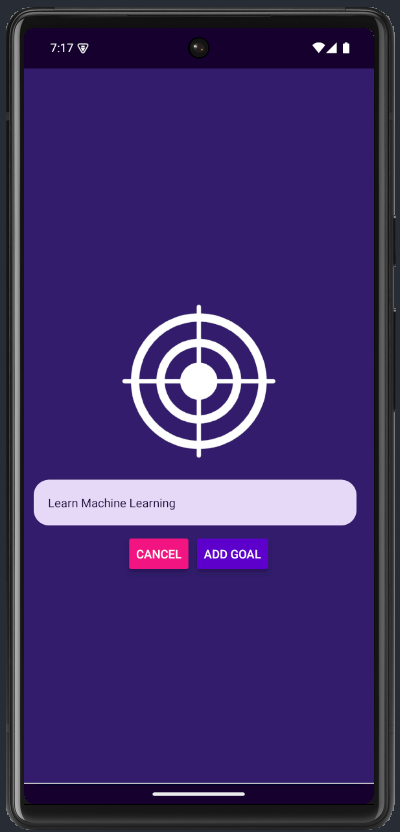

# Goals List - React Native App

A simple and elegant React Native mobile application for managing your personal goals. Built with Expo and featuring a clean, modern UI with modal-based goal input and interactive goal management.

## 📱 Features

- **Add Goals**: Create new goals using a beautiful modal interface
- **Delete Goals**: Remove completed or unwanted goals with a simple tap
- **Persistent Goal List**: View all your goals in an organized list format
- **Interactive UI**: Smooth animations and responsive design
- **Cross-Platform**: Works on both iOS and Android devices

## 🛠️ Tech Stack

- **React Native** (0.79.5) - Core framework
- **Expo** (~53.0.17) - Development platform and build tools
- **React** (19.0.0) - UI library
- **React Hooks** - State management with useState
- **Expo Status Bar** - Status bar styling

## 📦 Project Structure

```
GoalsList/
├── App.js                 # Main application component
├── index.js              # Entry point
├── package.json          # Dependencies and scripts
├── app.json              # Expo configuration
├── assets/               # Images and icons
│   ├── adaptive-icon.png
│   ├── favicon.png
│   ├── icon.png
│   ├── splash-icon.png
│   └── images/
│       ├── Add_Goal_Modal.png
│       ├── Goal_List.png
│       └── target.png
└── components/           # Reusable components
    ├── GoalInput.js      # Modal for adding new goals
    └── GoalItem.js       # Individual goal list item
```

## 🚀 Getting Started

### Prerequisites

- Node.js (version 14 or higher)
- npm or yarn package manager
- Expo CLI installed globally
- Android Studio (for Android development) or Xcode (for iOS development)

### Installation

1. **Clone the repository**

   ```bash
   git clone https://github.com/aaronersando/Goals-List.git
   cd GoalsList
   ```

2. **Install dependencies**

   ```bash
   npm install
   ```

3. **Start the development server**

   ```bash
   npm start
   # or
   expo start
   ```

4. **Run on your device**
   - Install Expo Go app on your mobile device
   - Scan the QR code displayed in terminal/browser
   - Or use the following commands for simulators:
   ```bash
   npm run android    # Android emulator
   npm run ios        # iOS simulator
   npm run web        # Web browser
   ```

## 📱 App Components

### Main App (App.js)

- Manages global state for goals list and modal visibility
- Handles goal addition and deletion logic
- Renders the main UI layout with header and goal list

### GoalInput Component

- Modal-based input form for adding new goals
- Features a target icon and styled text input
- Cancel and Add Goal buttons with proper validation

### GoalItem Component

- Individual goal display with pressable interaction
- Delete functionality on tap with visual feedback
- Styled with purple theme and rounded corners

## 🎨 Design Features

- **Dark Theme**: Beautiful purple gradient background (#1e085a)
- **Modal Interface**: Slide-up animation for goal input
- **Responsive Design**: Adapts to different screen sizes
- **Visual Feedback**: Press states and ripple effects
- **Custom Icons**: Target icon for goal creation

## 📱 Screenshots

### Main Goal List



_The main screen showing your list of goals with the "Add New Goal" button at the bottom._

### Add Goal Modal



_The modal interface for adding new goals with a target icon and input field._

## 🔧 Configuration

The app is configured through `app.json` with the following settings:

- **Dark Theme**: userInterfaceStyle set to "dark"
- **Custom Icons**: Target-themed app icons
- **Edge-to-Edge**: Modern Android display support
- **Splash Screen**: Custom splash screen configuration

## 📝 Available Scripts

- `npm start` - Start the Expo development server
- `npm run android` - Run on Android device/emulator
- `npm run ios` - Run on iOS device/simulator
- `npm run web` - Run in web browser

## 🤝 Contributing

1. Fork the repository
2. Create your feature branch (`git checkout -b feature/amazing-feature`)
3. Commit your changes (`git commit -m 'Add some amazing feature'`)
4. Push to the branch (`git push origin feature/amazing-feature`)
5. Open a Pull Request

## 📄 License

This project is open source and available under the [MIT License](LICENSE).

## 👨‍💻 Author

**Aaron Ersando**

- GitHub: [@aaronersando](https://github.com/aaronersando)

## 🙏 Acknowledgments

- Built as part of a React Native Full Course
- Expo team for the amazing development platform
- React Native community for continuous support

---

_Happy goal tracking! 🎯_
